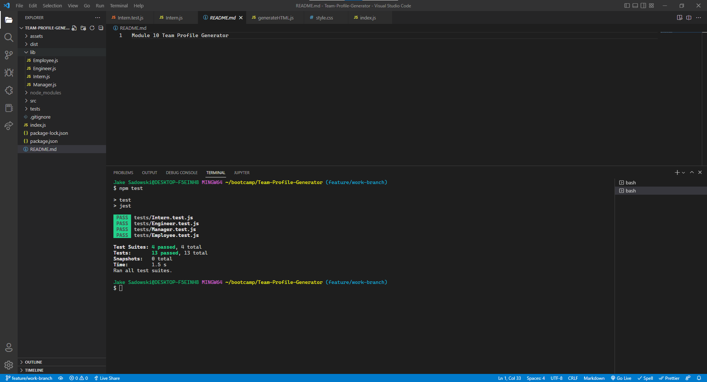

# Module 10 Team-Profile Generator

## Table of Contents
1. [Description](#description)
2. [Installation](#installation)
3. [Testing](#testing)
4. [Contribution](#contribution)
5. [Mock-Up](#mock-Up)
6. [Video](#video)
7. [License](#license)
8. [Contact](#contact)

## Description
This is the repository for a command line application that takes in information about employees on a software engineering team, then generates an HTML webpage that displays summaries for each person. This project was generated using Node.js, npm manager, and Inquirer during Module 10 of the UTA Bootcamp.

## Installation
For the installation of this application, the user must have Node.js as well as npm manager, using ``` npm i ``` in the command line.  Once the code is cloned locally and packages have been installed the user will run ``` node index.js ``` to begin the application.

## Testing
Run ``` npm test ``` in the command line to see the passed tests that were written for this project.

## Contribution
Currently not accepting contribution to this repo.

## Mock-Up
()

## Video


## License
Please see https://mit-license.org/ to get info about this license


## Contact
Email: jasadowski7@gmail.com
GitHub: https://github.com/jsadowski7
